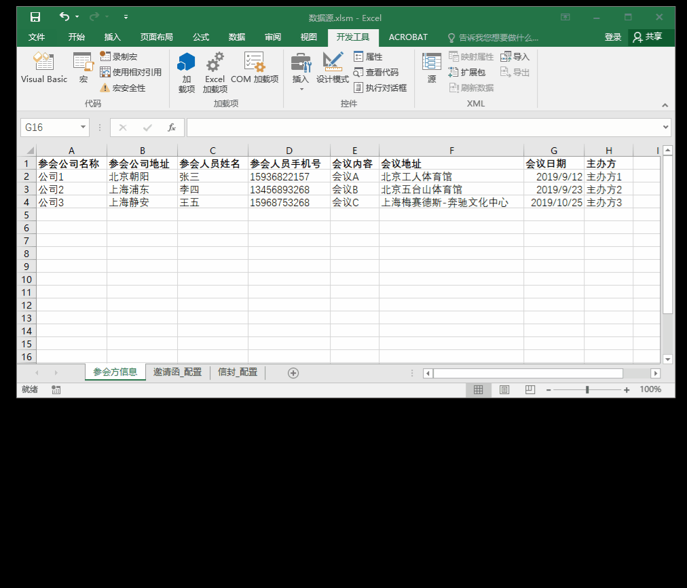

## Excel与Word联动 自动化生成格式文书

### 实现功能

* Excel 作为数据源，Word 作为模板，自动向模板指定位置填充数据

### 特色

* Word 邮件合并的懒人加强版
* 邮件合并适用于单次、大批量生成一堆报告，需要：手动打开模板位置-->选择收件人-->生成文书
* 本代码适用于生成报告操作频率高、但每次量很少的场景。你可能一天当中，零零散散地要生成n次，但每次只要几个
* 使用本代码，你的操作只是：确定要打印的行-->选择该行的任意单元格-->运行宏

### 使用须知

1. 需引用 Microsoft Word Object Library 和 Microsoft Scripting Runtime 对象库。路径：工具-->引用
2. Word 模板对应位置，添加 DocVariable 域，设置的域名必须和配置表一致
3. Word 域的使用方法，请查阅 https://support.office.com/en-us/article/insert-edit-and-view-fields-in-word-c429bbb0-8669-48a7-bd24-bab6ba6b06bb?ui=en-US&rs=en-US&ad=US
4. 模板路径，是相对路径写法
5. 操作方法：确定要打印的行-->选择该行的任意单元格-->运行宏 
6. 运行宏前，不要打开 Word 模板！否则，程序报错！

### 运行效果

